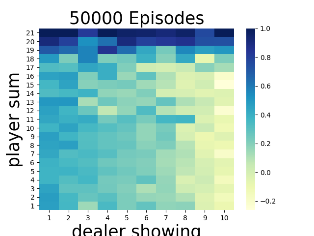
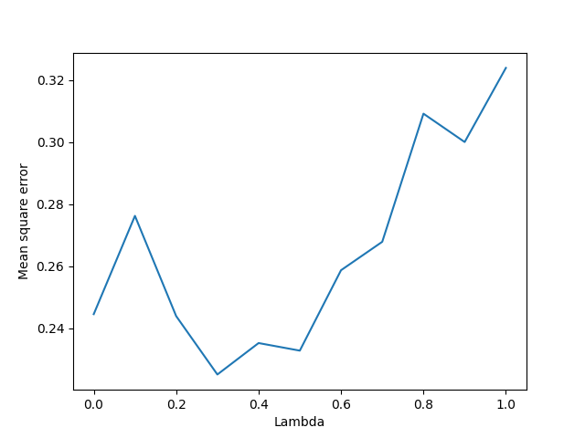
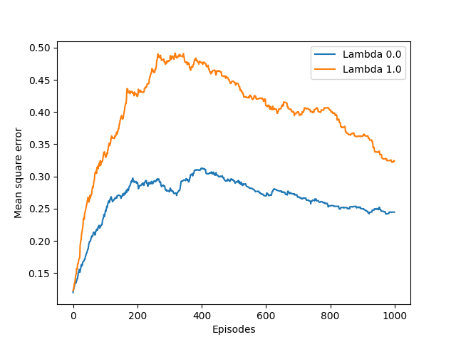

# Easy21
This is a project for  Reiknigreind - REI101M at the University of Iceland in the autumn of 2018.

The Project description can be found under "project_description.pdf".

# Project

## Short Description

We want to apply two different reinforcement learning techniques on the Easy21 game. Both will use a simple greedy policy.

* Monte Carlo Control
   - Repedeatly alter the value function to approximate the value function for the current policy, and policy is repeatedly improved with respect to the current value function.
* Sarsa Lambda
  - Extends eligibility-traces to action-value methods. Action-value is used to form the TD (Temporal Differnce) error. Where lambda determines the value of future rewards.

Easy21 is based of [blackjack](http://www.hitorstand.net/strategy.php) with some slight changes to the rules. 

* Game is played with infinite deck of cards.
* There are no aces or face value cards, each card from deck has a value of 1-10. Red cards negative values and black cards have positive value. When a card is drawn, the probability of red is 1/3 and the probability of black is 2/3.
* When a game is started the player and the dealer each draw one black card that is fully observable.
* Players and dealers go bust if the value of their hand goes below 1 or above 21.

There are only 2 actions a player can take:
* HIT -> Draw a new card.
* STAND -> Not draw any new cards.

## Player Policy
The player uses the ε-greedy policy (exploitation vs exploration). The player takes a greedy action with the probability of 1-ε and a random action with probability of ε.

## Dealer Policy
The dealer always sticks when is hand value is 17 or greate but otherwise hits.

## Reward
The game has three possible outcomes:
* Player wins (reward == 1)
  - Dealer goes bust or player ends with a higher card sum than the dealer.
* Player loses (reward == -1)
  - Player goes bust or dealer ends with a higher card sum than the player.
* Player draws (reward == 0)
  - Neither goes bust and dealer and player have the same card sum.

## Implementation

### Monte-Carlo Control and Easy21
The value function is initialized to zero. When a game finishes, alpha is calculated for each state action to evaluate the importance of the action taking with regards to the end reward. This is calculated with αt = 1/N(st,at) with N(s,a) being the count for how many times we found ourselves in state s and took action a. 

To calculate the ε for the ε-greedy policy we use εt = N0/(N0 + N(st) where N0 is a constant equal to 1000. N(s) is the count for how many times we have seen state s. 

### TD Learning Control and Easy21
To get the alpha here I used the same equation as in the Monte-Carlo Control implementation. 

The alogritmh is run with λ ∈ {0, 0.1, 0.2,..., 1}, playing a 1000 games for each λ. For each λ the mean squared error is calculated, by comparing the true values Q*(s,a) from the Monte-Carlo Control implementation with the estimated values Q(s,a) from the Sarsa at the end of the 1000 games. 

# Project Result and Interpretations

Results can be replicated by running the "Easy21.py" as is.

It runs the Monte-Carlo Control algorithm for 50.000 games. The plot below shows the results.

The plot shows the true value function on a heat map.

The plot shows us what we would expect.

* The closer the player is to 21 the more likely he is to win.
* When the dealers starting hand is low the odds of the player winning go up. This is logical since red cards have a negative sum, so if the dealer starts out with a low hand he is more likely to go bust when he draws a card. 

We used til result as Q* (true value function) and sent as a parameter into our Sarsa(λ) function. Sarsa then plays a 1000 games with each of the lambdas λ ∈ {0, 0.1, 0.2,..., 1}. After each game we calculate the mean-squared error, comparing it with Q*. The Sarsa function returns an array of arrays, where each inner array represents a λ and has a length of 1000 (1000 games played and mean-squared error calculated after each game). We can then get the last element of each inner array, i.e. the mean-squared error after a 1000 games for each of the lammdbas and plot it. We then get the following plot.

Since we are only playing a 1000 games for each lambda, these results can vary a bit each time we run Easy21.py. But we see that when the lambda grows that the mean-squared error grows. 

What we know is that learning takes longer time with Monte-Carlo Control compared to using a "one step look ahead". We also know that when λ = 1 then we can say that Sarsa is learning bu using the Monte-Carlo Control method but when λ = 0 we are using a "one step look ahead". So, for lower λ we are quicker to learn as apposed to higher λand that is why the mean-squared error rises with higher λ (also a few games for each λ). 

We can also note that if we play a lot of games for each λ the plot becomes meaningless since the mean-squared error for all λ will go closer to 0.

We can now get the first and last inner arrays, i.e. mean-squared error for all games played when λ = 0 and λ = 1 and plot the learning curve against mean-square error and times played. We then get the following plot:

Again we see that with lower λ we are quicker to learn. The more games we play the closer both these lines go to 0. 
